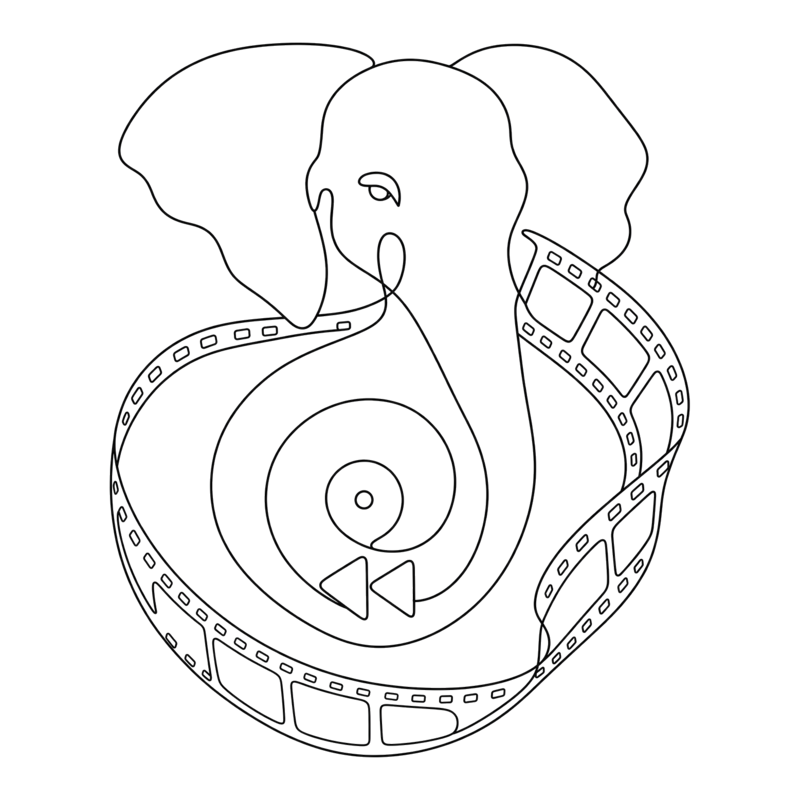

<p align="center">
  <picture>
    <source media="(prefers-color-scheme: dark)" srcset="docs/assets/logo-dark.png">
    
  </picture>
</p>

# Buffer

A screen recorder utility that runs continuously in the background (like a dashcam). When a bug happens, hit a hotkey to save the last 30 seconds of screen recording.

## Features

- 🎥 Continuous screen recording in the background
- ⏱️ Configurable buffer duration (default: 30 seconds)
- ⌨️ Global hotkey (Cmd+Shift+S) to save buffer instantly
- 📍 Menubar application (no dock icon)
- 💾 Automatic file saving with timestamps

## Installation

1. Install dependencies:
```bash
npm install
```

2. Run the application:
```bash
npm start
```

## Usage

1. The app will appear in your menubar (top right on macOS)
2. Click the menubar icon to open the settings window
3. Configure the buffer duration (how many seconds to keep)
4. The app continuously records your screen in the background
5. When you encounter a bug, press **Cmd+Shift+S** (or click "Save Buffer Now")
6. The recording will be saved to `~/Documents/Buffer Recordings/`

## Configuration

- **Buffer Duration**: How many seconds of recording to keep in the buffer (5-300 seconds)
- **Save Directory**: Where recordings are saved (default: `~/Documents/Buffer Recordings/`)

## Building

To build a distributable app:

```bash
npm run build
```

## Permissions

On macOS, you'll need to grant:
- **Screen Recording** permission (System Preferences > Security & Privacy > Privacy > Screen Recording)
- **Accessibility** permission (for global hotkeys)

## Notes

- The app runs continuously in the background
- Only the last N seconds (configurable) are kept in memory
- Recordings are saved as WebM files
- The app doesn't appear in the dock (menubar only)


